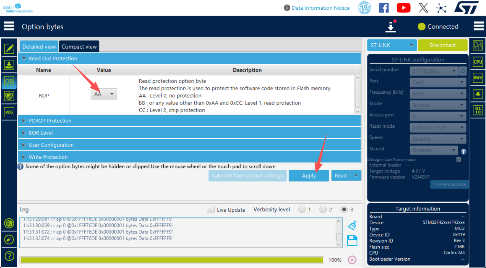

# PX4项目在WSL Ubuntu中的详细调试指南（仅供内部参考）
## STM32F427飞控硬件调试

本指南针对在Windows 11 WSL Ubuntu环境中使用ST-Link调试器开发PX4项目提供完整的工具链配置和调试流程。

---

## 第一部分：环境准备

### 1.1 WSL Ubuntu环境检查

首先，确保您已正确安装WSL2和Ubuntu：

```bash
# 检查WSL版本
wsl --version

# 检查Ubuntu发行版
lsb_release -a

# 推荐版本
# WSL2: 5.15.x 或更高
# Ubuntu: 24.04 LTS 或 22.04 LTS ，目前我们内部统一推荐使用24.04 LTS
```

### 1.2 基础依赖安装

运行PX4项目提供的Ubuntu安装脚本：

```bash
cd ~/PX4-Autopilot/debug_guide
bash ./Tools/setup/ubuntu.sh
```

此脚本会自动安装以下组件：
- **arm-none-eabi-gcc** - ARM编译工具链
- **cmake** 和 **ninja** - 构建系统
- **gdb** - GNU调试器
- **Python3** - 脚本支持，这里我本地是miniconda环境,python 3.13.5
- 其他必要依赖

### 1.3 验证安装

```bash
# 验证工具链
arm-none-eabi-gcc --version
gdb-multiarch --version
cmake --version
ninja --version

# 预期输出示例：
# arm-none-eabi-gcc (15:13.2.rel1-2) 13.2.1 20231009
```

** 注意：Ubuntu 24.04 上的 GDB 变更**

在 Ubuntu 24.04 及更新版本中，`arm-none-eabi-gdb` 包已被统一的 `gdb-multiarch` 替代。

**原因：**
- ARM 官方工具链现在只通过 `gcc-arm-none-eabi` 提供编译工具
- GDB 调试器由 Ubuntu/Debian 统一的 `gdb-multiarch` 提供（支持所有架构）
- 这样做可以减少包管理复杂性，统一维护

**解决方案：**

**方法1：创建符号链接（推荐，兼容所有脚本）**
```bash
# 一次性设置
sudo ln -sf /usr/bin/gdb-multiarch /usr/bin/arm-none-eabi-gdb

# 验证
arm-none-eabi-gdb --version
```
设置后，所有脚本和文档中的 `arm-none-eabi-gdb` 命令都能正常使用。

**方法2：直接使用 `gdb-multiarch`（官方标准）**
```bash
# 直接替换 arm-none-eabi-gdb 为 gdb-multiarch
gdb-multiarch build/kite_f427_default/kite_f427_default.elf
```

### 1.4 关于华科尔f423说明
由于华科尔是ArduPilot模式，所以我们首先需要STM32F427飞控硬件刷机bootloader，步骤如下：
- **STM32CubeProgrammer** - 下载安装STM32CubeProgrammer
- **St-link接线** - 按照3.1.1的接线方式接线连接硬件，如果已经把端口转接到wsl，那就需要执行usbipd unbind --busid 3-4
- **刷机bootloader** - 使用STM32CubeProgrammer刷机bootloader
    - **打开STM32CubeProgrammer** 
    - **进入Erasing & Programming** - 左侧download图标，进入后点击右侧ST-LINK，连接
    - **File path** - 选择bootloader文件，飞控项目boards/kite/f427/extras/kite_f427_bootloader.bin
    - **Start address** - 0x08000000
    - **Erase flash memory** - 右侧擦除闪存-Full chip erase

    - **ob处理** - 如果上面的擦除闪存提示错误，就点击左边栏的OB图标-Detailed view，然后点击Read Out Protection, name : RDP ,把value改为AA，点击右下角的Apply，然后再回去擦除闪存
    
    - **Program memory** - 选择Program memory
    - **勾选** - 勾选左侧的Verify programming 、Run after programming
    - **Start Programming** - 点击Start Programming
    - **完成** - 完成后，在设备管理器(window+x)打开设备管理器，能查看到其他设备 PX4 BL KITE F427
    - **设置设备** - 右键点击PX4 BL KITE F427，选择更新驱动程序，选择浏览我的电脑以查找设备驱动，选择 让我从计算机上的可用驱动程序列表中选取，选择端口(COM和LPT)，选择Microsoft，选择USB串行设备, 然后就可以在设备管理器-端口下看到新的， 如果需要把设备连到wsl，那也是需要执行2.4.2步骤把 st-link与f427的usb端口映射到wsl


---

## 第二部分：OpenOCD与ST-Link配置

### 2.1 安装 OpenOCD

在 WSL Ubuntu 中安装 OpenOCD：

```bash
# 方法1：使用 apt 包管理器（推荐）
sudo apt-get update
sudo apt-get install -y openocd

# 方法2：从源代码编译（高级用户）
git clone https://github.com/openocd-org/openocd.git
cd openocd
./bootstrap
./configure --enable-stlink
make -j4
sudo make install
```

### 2.2 验证OpenOCD安装

```bash
openocd --version
# 预期输出: Open On-Chip Debugger x.x.x
```

### 2.3 ST-Link驱动和权限配置

#### 2.3.1 规则文件配置（WSL中运行）

创建udev规则以允许用户访问ST-Link设备：

```bash
# 创建udev规则文件
sudo nano /etc/udev/rules.d/50-stlink.rules
```

添加以下内容：

```
# STM32 ST-LINK
SUBSYSTEMS=="usb", ATTRS{idVendor}=="0483", ATTRS{idProduct}=="3748", MODE="0666"
# STM32 ST-LINK/V2
SUBSYSTEMS=="usb", ATTRS{idVendor}=="0483", ATTRS{idProduct}=="374b", MODE="0666"
# STM32 ST-LINK/V2.1
SUBSYSTEMS=="usb", ATTRS{idVendor}=="0483", ATTRS{idProduct}=="374d", MODE="0666"
```

然后ctrl+x，y 保存并退出nano编辑器。
重新加载规则：

```bash
sudo udevadm control --reload-rules
sudo udevadm trigger
```

#### 2.3.2 用户组权限

将当前用户添加到dialout和plugdev组：

```bash
# 添加到组
sudo usermod -a -G dialout $USER
sudo usermod -a -G plugdev $USER

# 查看当前用户所属组
groups $USER

# 注意：需要重新登录或重启WSL使权限生效，注意，这里是需要关闭所有的wsl窗口，在power shell中输入
exit # 在所有wsl上退出，退出当前WSL窗口，如果是在vscode，就关闭全部
wsl --shutdown
# 重新打开WSL shell
wsl -d Ubuntu
```

### 2.4 Windows侧的USBIPD-WIN配置

由于WSL不能直接访问USB设备，需要使用USBIPD-WIN项目共享USB设备。

#### 2.4.1 在Windows上安装USBIPD-WIN

以管理员权限打开PowerShell（Windows侧），我一般使用win11的终端：

```powershell
# 检查是否已安装winget
winget --version

# 如果未安装，使用以下方式（Windows 11已预装）
# 或从 https://github.com/microsoft/usbipd-win/releases 手动下载安装

# 使用winget安装USBIPD-WIN
winget install usbipd

# 验证安装
usbipd --version
```

#### 2.4.2 列出和共享USB设备

在Windows PowerShell中执行（管理员权限）：

```powershell
# 列出所有USB设备
usbipd list

# 输出示例：
# BUSID  VID:PID    DEVICE
# 6-1    0483:3748  STM32 STLink   

# 查找ST-Link设备的BUSID（通常是 0483:3748 或 0483:374b）
```

找到ST-Link的BUSID后，执行绑定和连接：

```powershell
# 绑定USB设备（仅需执行一次）
usbipd bind --busid 3-4

# 验证设备已绑定
usbipd list

usbipd attach --wsl --busid 3-4

# 验证连接（在WSL中）
lsusb
# 应该看到类似输出：
# Bus 001 Device 002: ID 0483:3748 STMicroelectronics ST-LINK/V2
```

#### 2.4.3 自动化USB连接脚本，这个可以不用，那就需要手动执行转接命令

创建Windows批处理脚本以简化连接：

在Windows创建文件 `C:\Users\<YourUsername>\connect_stlink.bat`：

```batch
@echo off
REM 连接ST-LINK到WSL
REM 需要以管理员权限运行，注意3-4是ST-Link的BUSID，每个人电脑不一样

echo Checking if ST-LINK is already connected...
usbipd list | findstr /I "3-4.*attached"
if errorlevel 1 (
    echo Connecting ST-LINK to WSL...
    REM 使用新的attach命令
    usbipd attach --wsl --busid 3-4
) else (
    echo ST-LINK is already connected
)

echo Done!
pause
```

创建快捷方式时选择"以管理员身份运行"。

#### 2.4.4 解除USB设备绑定

在完成调试后断开USB设备：

```powershell
usbipd detach --busid 3-4

# 解除绑定（可选，下次使用时再绑定）
usbipd unbind --busid 3-4
```


## 第三部分：硬件连接

### 3.1 ST-Link与STM32F427的物理连接

#### 3.1.1 SWD接口连接（推荐）

ST-Link支持SWD（Single Wire Debug）和JTAG两种调试接口。SWD仅需4条线，推荐使用。

**SWD引脚定义（20针连接器标准）：**

| ST-Link针脚 | 信号名 | STM32F427引脚 | 功能 |
|------------|--------|--------------|------|
| 1 | VDD | 3.3V | 电源参考 |
| 2 | SWDIO | PA13 | 调试数据线 |
| 3 | GND | GND | 地线 |
| 4 | SWCLK | PA14 | 调试时钟线 |
| 5 | GND | GND | 地线 |

**最小连接（4条线）：**

```
ST-Link          STM32F427
  1 (VDD) -----> 3.3V
  2 (SWDIO) ----> PA13
  4 (SWCLK) ----> PA14
  GND ----------> GND
```

#### 3.1.2 USB供电配置

**方案1：通过ST-Link供电（调试用）**
- ST-Link VDD脚输出3.3V，可为MCU提供小电流
- 仅用于固件烧录和在线调试
- 不适合长期运行或高负载场景

**方案2：通过飞控板USB或电源供电（推荐）**
- 使用外部电源或USB为飞控板供电
- ST-Link仅用于调试信号
- 更稳定可靠

#### 3.1.3 接线建议

- 使用高质量的SWD调试线（< 20cm）
- 确保所有地线连接正确
- 使用金属屏蔽线避免电磁干扰
- 总得来说就是usb线与st-link线都插上
- **不要在设备上电时插拔调试线**


### 3.2 USB数据线连接

飞控板配置的USB接口用于：
- 固件烧录
- 串口日志输出（UART7）
- 参数调整（MAVLink通信）

**USB连接：**

```
STM32F427 USB OTG
USB_D+ (PA12) -----> USB数据线 (D+)
USB_D- (PA11) -----> USB数据线 (D-)
USB_VBUS (PA9) -----> USB数据线 (VBUS)
GND ----------> USB数据线 (GND)
```

---

## 第四部分：固件构建和烧录

### 4.1 构建PX4固件

#### 4.1.1 基础构建

```bash
# 进入PX4项目目录
cd ~/PX4-Autopilot

# 构建kite_f427的固件
make kite_f427_default

# 构建结果位置：
# build/kite_f427_default/kite_f427_default.bin  (二进制文件)
# build/kite_f427_default/kite_f427_default.elf  (ELF文件，包含调试符号)
```

#### 4.1.2 清理和完整重建

```bash
# 清理构建文件
make clean

# 清理所有构建目录
make distclean

# 完整重建
make kite_f427_default -j$(nproc)
```

### 4.2 固件烧录方法

#### 方法1：通过OpenOCD和GDB烧录（推荐）

**4.2.1 启动OpenOCD**

在WSL终端中创建OpenOCD配置文件：

`openocd_stm32f427.cfg` 内容：

```tcl
# STM32F427 with ST-Link/V2
source [find interface/stlink.cfg]
source [find target/stm32f4x.cfg]

# 连接后自动初始化
init

# 调试器频率配置
adapter speed 1000
```

启动OpenOCD：

```bash
# 终端1：启动OpenOCD, 如果open error，请检查4.2.2节内容是否执行ok
openocd -f ./debug_guide/openocd_stm32f427.cfg

# 预期输出（OpenOCD v0.12.0+）：
# Open On-Chip Debugger 0.12.0
# Licensed under GNU GPL v2
# For bug reports, read
#         http://openocd.org/doc/doxygen/bugs.html
# Info : auto-selecting first available session transport "hla_swd". To override use 'transport select <transport>'.
# Info : The selected transport took over low-level target control. The results might differ compared to plain JTAG/SWD
# Info : clock speed 1000 kHz
# Info : STLINK V2J40S7 (API v2) VID:PID 0483:3748
# Info : Target voltage: 4.417934
# Info : [stm32f4x.cpu] Cortex-M4 r0p1 processor detected
# Info : [stm32f4x.cpu] target has 6 breakpoints, 4 watchpoints
# Info : starting gdb server for stm32f4x.cpu on 3333
# Info : Listening on port 3333 for gdb connections
# Info : Listening on port 6666 for tcl connections
# Info : Listening on port 4444 for telnet connections

# 注意事项：
# 1. "DEPRECATED! use 'adapter speed' not 'adapter_khz'" 是正常警告，表示配置已自动更新
# 2. 如果出现 "Error: reset device failed"，请检查：
#    - ST-Link是否已正确连接
#    - SWD接线是否完整（SWDIO、SWCLK、GND、VDD）
#    - 飞控板是否有电源
#    - 硬件是否存在故障
```

**4.2.2 通过GDB烧录和调试**

```bash
# 终端2：启动GDB，在vscode中可以点击终端的加号或者旁边的拆分终端按钮，我一般用拆分终端按钮（点击终端，按ctrl+shift+5）
cd build/kite_f427_default
arm-none-eabi-gdb kite_f427_default.elf

# GDB提示符出现后，执行以下命令：
(gdb) target extended-remote :3333
(gdb) monitor reset halt
(gdb) load
(gdb) monitor reset init
(gdb) c # 这个注意，在window下需要按完整名称continue
```

#### 方法2：使用Make命令烧录（需要配置）

**注意：WSL通过USBIPD连接USB设备可能不够稳定，不推荐自动上传**

```bash
# 仅当USB设备正确连接时可用，这个注意不是在gdb下
# 如果用wsl上传，那需要把KITE F427的usb也连接到wsl，也就是st-link与kite f427的usb线连接到wsl
make kite_f427_default upload 

# 如果连接失败，使用上述OpenOCD+GDB方法
```


#### 方法3：通过QGroundControl烧录（Windows侧）

```bash
# 在Windows上安装QGroundControl
# 下载地址：https://qgroundcontrol.com/

# 构建固件后，通过文件浏览器访问WSL中的固件：
# \\wsl.localhost\Ubuntu\home\<username>\PX4-Autopilot\build\kite_f427_default\

# 在QGC中：
# 1. Vehicle Setup -> Firmware
# 2. 选择 "Custom firmware file"
# 3. 选择上述路径中的 kite_f427_default.px4
# 4. 点击烧录
```

---

## 第五部分：在线调试

### 5.1 使用GDB进行调试

#### 5.1.1 启动调试会话

**终端1：启动OpenOCD**

```bash
openocd -f ./debug_guide/openocd_stm32f427.cfg
```

**终端2：启动GDB调试**

```bash
cd ./build/kite_f427_default
arm-none-eabi-gdb kite_f427_default.elf

```

#### 5.1.2 GDB常用调试命令

```gdb
# 连接到OpenOCD
target extended-remote :3333

# 重置MCU
monitor reset halt

# 加载固件到RAM
load

# 设置断点
break main
break stm32_boardinitialize
break led_init

# 条件断点
break scheduler.cpp:123 if count > 10

# 执行到断点
continue

# 单步执行
step          # 进入函数
next          # 跳过函数
finish        # 执行完当前函数并返回

# 查看变量和寄存器
print variable_name
print $r0      # ARM寄存器
print $sp      # 堆栈指针
print $pc      # 程序计数器

# 查看堆栈回溯
backtrace
bt

# 设置监测点
watch led_state
awatch sensor_data    # 读写访问都监控

# 查看内存
x 0x20000000          # 查看内存内容
x/32wx 0x20000000     # 查看32个32位字

# 反汇编
disassemble
disassemble 0x08004000,0x08004100

# 保存和还原上下文
define save_context
  save breakpoints ~/.gdb_breakpoints
  save history ~/.gdb_history
end

# 设置调试符号路径
set debug-file-directory /path/to/symbols
```

### 5.2 调试示例：跟踪LED初始化

```bash
# 假设要调试LED初始化流程

arm-none-eabi-gdb kite_f427_default.elf

(gdb) target extended-remote :3333
(gdb) monitor reset halt
(gdb) load

# 设置LED初始化的断点
(gdb) break led_init
(gdb) break stm32_configgpio

# 启动MCU
(gdb) continue

# 当断点触发时，查看调用堆栈和变量
(gdb) backtrace
(gdb) print gpio_pin
(gdb) print gpio_mode

# 单步执行LED驱动初始化代码
(gdb) step
(gdb) step
(gdb) print gpio_config
```

### 5.3 高级调试技巧

#### 5.3.1 硬件断点管理

STM32F427有6个硬件断点和4个监测点（有限资源）：

```gdb
# 查看当前断点
info breakpoints

# 删除断点
delete 1           # 删除断点1
delete             # 删除所有断点
disable 1          # 禁用断点1
enable 1           # 启用断点1

# 临时断点（单次命中后自动删除）
tbreak main
tbreak spi.cpp:150

# 动态断点管理策略（针对有限硬件断点）
# 1. 早期启动阶段：设置板级初始化断点
break __start
break board_initialize
break stm32_boardinitialize
continue
# 命中后删除
delete

# 2. 中期调试：设置传感器初始化断点
break bmi088_init
break spl06_init
continue
# ...

# 3. 后期调试：设置任务调度和系统断点
break px4_main
break scheduler_run
```

#### 5.3.2 内存监测和损坏检测

```gdb
# 监测特定内存地址的变化（如堆栈溢出）
awatch *0x20000000         # 任何访问
watch *(int*)0x20001000    # 整数变量
rwatch *0x20002000         # 只读访问

# 条件监测
watch global_counter if global_counter > 100

# 内存转储
dump binary memory output.bin 0x20000000 0x20010000
dump intel-hex memory output.hex 0x20000000 0x20010000
```

#### 5.3.3 远程调试和日志记录

```gdb
# 启用GDB调试日志
set logging on
set logging file gdb_session.log

# 执行调试会话...
# 日志保存在 gdb_session.log

# 查看日志
cat gdb_session.log
```

---

## 第六部分：USB数据线日志和参数调整

### 6.1 USB串口日志查看

飞控板USB连接后，可通过串口工具查看系统日志。

#### 6.1.1 识别USB串口设备

```bash
# 连接USB数据线后，检查设备列表
lsusb
# 输出应包含 STMicroelectronics 或 USB设备

# 查看所有串口设备
ls /dev/ttyUSB* /dev/ttyACM*

# 通常显示：/dev/ttyACM0 或 /dev/ttyUSB0
```

#### 6.1.2 使用Minicom查看日志

```bash
# 安装minicom
sudo apt-get install minicom

# 配置并打开
sudo minicom -s
# 在配置菜单中设置：
# - Serial port: /dev/ttyACM0 (或 /dev/ttyUSB0)
# - Bps/Par/Bits: 115200 8N1
# - 其他使用默认值

# 快速打开（已配置后）
sudo minicom -D /dev/ttyACM0

# 启用日志记录（在minicom中按 Ctrl+A, Z, L）
```

#### 6.1.3 使用picocom查看日志（更简洁）

```bash
# 安装picocom
sudo apt-get install picocom

# 打开串口（波特率115200，8位数据，无校验，1个停止位）
sudo picocom -b 115200 /dev/ttyACM0

# 退出：Ctrl+A, Ctrl+X
```


### 6.2 参数调整（通过MAVProxy或QGroundControl）

#### 6.2.1 使用MAVProxy

```bash
# 安装MAVProxy
pip install MAVProxy

# 连接到飞控
mavproxy.py --master=/dev/ttyACM0 --baudrate=115200

# 在MAVProxy终端中的常用命令
# 读取参数
param show BATT_*          # 显示所有电池相关参数
param show SYS_*           # 显示所有系统参数

# 设置参数
param set BATT_MONITOR 4   # 启用电池监控
param set RC_MAP_ROLL 1    # RC通道映射

# 保存参数到文件
param download

# 重新启动飞控
reboot
```

#### 6.2.2 使用QGroundControl（推荐）

```bash
# Windows侧安装QGroundControl后，连接到飞控

# 在QGroundControl中：
# 1. Vehicle Setup -> Parameters
# 2. 搜索参数名称
# 3. 修改数值并点击"Save"
# 4. 参数立即应用

# 常用参数调整：
# SYS_AUTOSTART        飞机类型
# BATT_MONITOR         电池监控方式
# BATT_V_CHARGED       满电压
# BATT_V_EMPTY         最低电压
# CAL_GYRO_*           陀螺仪校准值
# CAL_ACC_*            加速度计校准值
```

---

## 第七部分：常见调试问题排查

### 7.1 ST-Link识别失败或USB映射未成功

**问题：**OpenOCD 显示 `Error: open failed`，WSL 中看不到 ST-Link 设备

**症状检查：**

```bash
# 1. 检查WSL中是否能看到ST-Link设备
lsusb | grep -i stm
# 如果没有输出，说明ST-Link未映射到WSL

# 2. 检查是否有USB串口设备
ls -la /dev/ttyUSB* /dev/ttyACM*
# 应该看到类似 /dev/ttyACM0 或 /dev/ttyUSB0 的设备

# 3. 检查用户权限
groups $USER
# 应该包含 dialout、plugdev、docker 等组
```

#### 解决方案1：重启WSL和USB服务

```bash
# 在WSL中
exit  # 退出WSL
```

```powershell
# 在Windows中
wsl --shutdown  # 关闭WSL
Start-Sleep -Seconds 3
# 然后重新打开WSL
```

#### 解决方案2：启用OpenOCD详细日志诊断

```bash
# 在WSL中启用最高级别的调试日志
openocd -f ./debug_guide/openocd_stm32f427.cfg -d4 2>&1 | tee openocd_debug.log

# 查看日志（最后50行）
tail -50 openocd_debug.log

# 查看关键错误信息
grep -i "error\|failed\|not found" openocd_debug.log
```

**快速诊断流程：**

```bash
# Step 1: Windows侧
# PowerShell (管理员)
usbipd list | grep 0483

# Step 2: 如果未显示或显示"Not shared"
usbipd bind --busid <BUSID>
usbipd attach --wsl --busid <BUSID>

# Step 3: WSL侧验证
lsusb | grep STMicroelectronics  # 应该看到设备

# Step 4: 测试OpenOCD
openocd -f ./debug_guide/openocd_stm32f427.cfg
# 应该看到 "Info : Listening on port 3333"

# Step 5: 如果还是失败
openocd -f ./debug_guide/openocd_stm32f427.cfg -d3  # 查看详细日志
```

---

### 7.2 USB数据线通信中断

**问题：**USB通过USBIPD连接到WSL后频繁断开

**解决方案：**

```bash
# 1. 重新连接USB设备
# （Windows PowerShell 管理员权限）
usbipd disconnect --busid 6-1
usbipd connect --busid 6-1

# 2. 检查WSL系统日志
dmesg | tail -20

# 3. 重新启动WSL
exit
wsl --shutdown
wsl

# 4. 增加USB超时时间
echo "options usbserial" | sudo tee /etc/modprobe.d/usbserial.conf
echo "options ch341 force_cts=1" | sudo tee -a /etc/modprobe.d/ch341.conf
sudo modprobe -r ch341 usbserial
sudo modprobe ch341 usbserial force_cts=1
```

### 7.2 OpenOCD"Error: reset device failed"错误

**问题：**OpenOCD无法连接或复位STM32F427，显示以下错误：
```
Error: reset device failed
```

**排查步骤（按优先级）：**

#### 步骤1：检查硬件连接

```bash
# 1. 验证ST-Link是否在Windows侧识别
# （Windows PowerShell）
usbipd list
# 应该看到类似：
# BUSID  VID:PID    DEVICE
# 3-4    0483:3748  STM32 ST-LINK/V2

# 2. 验证ST-Link是否已连接到WSL
# （WSL终端）
lsusb | grep STMicroelectronics
# 应该看到：Bus 001 Device XXX: ID 0483:3748 STMicroelectronics ST-LINK/V2

# 3. 物理接线检查（最重要）
# SWD接线标准：
# ST-Link Pin1 (VDD)  -> STM32F427 3.3V
# ST-Link Pin2 (SWDIO) -> STM32F427 PA13
# ST-Link Pin4 (SWCLK) -> STM32F427 PA14
# ST-Link Pin3/5 (GND) -> STM32F427 GND
#
# 检查接线：
# - 使用万用表或逻辑分析仪验证电压
# - 确保所有接线牢固可靠
# - GND连接必须完整（多点接地最好）
```

#### 步骤2：检查飞控板电源

```bash
# 1. 验证飞控板供电
# - 检查飞控板上的电源指示灯
# - 使用万用表测量3.3V和5V电压
#
# 2. 电源来源选择：
# 方案A：USB供电
#   - 连接ST-Link的VDD脚到飞控板的3.3V
#   - 连接USB数据线到飞控板
#   - 两个电源同时供电
# 
# 方案B：独立电源
#   - 使用外部电源供电飞控板（3.3V）
#   - ST-Link仅用于调试信号
#   - 确保共地（GND必须连接）
```

#### 步骤3：检查OpenOCD配置

```bash
# 1. 验证配置文件正确性
cat openocd_stm32f427.cfg
# 应该包含：
# source [find interface/stlink.cfg]
# source [find target/stm32f4x.cfg]
# adapter speed 1000  (或旧版本的 adapter_khz 1000)
# init

# 2. 调试日志启用
openocd -f ./debug_guide/openocd_stm32f427.cfg -d3
# 参数说明：
# -d0: 没有调试输出
# -d1: 最少输出
# -d2: 标准输出
# -d3: 详细调试信息
# -d4: 最详细（包括二进制协议）

# 3. 如果仍然失败，尝试降低频率
# 编辑 openocd_stm32f427.cfg
# adapter speed 500   # 降低到500kHz
```

#### 步骤4：检查ST-Link版本和驱动

```bash
# 1. 在Windows上检查ST-Link驱动
# 设备管理器 -> 通用串行总线控制器
# 应该看到 "STM32 STLink" 或相似设备

# 2. 如果显示黄色感叹号，需要安装驱动
# 下载地址：https://www.st.com/en/development-tools/st-link-v2.html

# 3. WSL端驱动检查
# udev规则应该已配置（参考第一部分 2.3.1）
ls -la /etc/udev/rules.d/50-stlink.rules
# 内容应包含 ATTRS{idVendor}=="0483"
```

#### 步骤5：尝试其他连接方式

```bash
# 如果SWD不工作，尝试JTAG（需要更多引脚）
# 编辑 openocd_stm32f427.cfg，添加：
# transport select jtag

# JTAG接线（5条线最少）：
# ST-Link Pin7 (TCO) -> STM32F427 PA15
# ST-Link Pin9 (TDI) -> STM32F427 PA7
# ST-Link Pin5 (TCLK) -> STM32F427 PA14
# ST-Link Pin3/5 (GND) -> STM32F427 GND
```

#### 步骤6：硬件故障排查

```bash
# 1. 测试STM32F427是否损坏
# - 尝试用其他调试器（如J-Link）
# - 检查芯片是否发热
# - 查看PCB是否有烧焦痕迹

# 2. 测试ST-Link是否损坏
# - 尝试连接其他STM32设备
# - 连接到一个工作正常的飞控板
# - 检查ST-Link的LED是否正常闪烁

# 3. 如果两者都不工作，可能需要更换硬件
```

---

### 7.3 调试时MCU复位

**问题：**调试时MCU频繁复位，无法停在断点

**原因和解决：**

```bash
# 1. 检查看门狗配置
# 在GDB中禁用看门狗
(gdb) monitor halt
(gdb) set *0x40000000 = 0          # IWDG_KR（看门狗密钥）

# 2. 检查NRST引脚连接
# 确保 NRST 正确连接到 ST-Link 的 RST 脚

# 3. 降低适配器频率
# 编辑 openocd_stm32f427.cfg
# adapter_khz 500                   # 降低到500kHz

# 4. 检查固件中的复位处理
# 在main或初始化函数中添加调试信息
```

### 7.4 GDB无法加载符号

**问题：**GDB加载固件后无法解析函数名，显示 `??` 或地址

**解决：**

```bash
# 1. 确保使用ELF文件，不是BIN文件
file build/kite_f427_default/kite_f427_default.elf
# 应该显示 "ELF 32-bit LSB executable"

# 2. 确认编译时启用了调试符号
# 检查CMakeLists.txt或编译参数是否包含 -g

# 3. 在GDB中显式加载符号
(gdb) symbol-file kite_f427_default.elf
(gdb) add-symbol-file kite_f427_default.elf 0x08004000

# 4. 检查符号是否被剥离
arm-none-eabi-objdump -t kite_f427_default.elf | head -20
```

### 7.5 硬件断点超出限制

**问题：**`Cannot insert hardware breakpoint`

**解决（根据之前的经验）：**

```bash
# STM32F427仅有6个硬件断点，采用分阶段策略

# 阶段1：早期启动
(gdb) tbreak __start          # 临时断点
(gdb) tbreak board_initialize
(gdb) continue
# ...删除这些断点后...

# 阶段2：驱动初始化
(gdb) tbreak spi_init
(gdb) tbreak i2c_init
(gdb) continue

# 阶段3：应用逻辑
(gdb) tbreak main
(gdb) tbreak my_task
(gdb) continue

# 使用 info breakpoints 查看当前断点数
(gdb) info breakpoints
```

### 7.6 UART调试输出为乱码

**问题：**通过USB数据线看到的日志全是乱码

**排查：**

```bash
# 1. 检查波特率设置
# 在picocom中：
sudo picocom -b 115200 /dev/ttyACM0

# PX4默认波特率：115200

# 2. 检查USB转UART芯片
# 飞控板上可能使用 CH340 或其他芯片
# 需要安装对应驱动（通常WSL自动识别）

# 3. 查看dmesg日志
dmesg | grep -i usb | tail -10

# 4. 重新加载驱动
sudo modprobe -r ftdi_sio
sudo modprobe ftdi_sio

# 5. 检查设备权限
ls -la /dev/ttyACM0
# 如果权限为 crw------- 需要修改
sudo chmod 666 /dev/ttyACM0
```

---

## 第八部分：高级调试技巧

### 8.1 使用GDB启动脚本自动化调试

创建 `debug.gdb`：

```gdb
# 连接到OpenOCD
target extended-remote :3333

# 重置并停止MCU
monitor reset halt

# 加载固件
load

# 设置常用断点（根据需要修改）
break main
break board_initialize
break stm32_boardinitialize

# 设置监控变量
define watch_system_state
  watch system_state
  watch led_state
  watch sensor_data
end

# 启动执行
continue
```

运行：

```bash
arm-none-eabi-gdb -x debug.gdb kite_f427_default.elf
```

### 8.2 多核调试和RTOS感知调试

虽然STM32F427是单核，但调试RTOS（NuttX）任务需要特殊支持：

```gdb
# 查看所有任务
(gdb) info threads

# 切换到特定任务
(gdb) thread 2

# 在所有任务中设置断点
(gdb) break stm32_boardinitialize -a   # -a 表示全局

# 查看NuttX任务列表（如果有相关命令）
(gdb) monitor nuttx show_taskdata
```

### 8.3 性能分析和覆盖率

```bash
# 编译时启用覆盖率支持
make kite_f427_default -DCMAKE_BUILD_TYPE=Debug

# 运行并收集覆盖率数据
# （需要固件支持，可能需要特殊配置）

# 生成覆盖率报告
arm-none-eabi-cov ...
```

### 8.4 SWO和实时数据流

某些ST-Link版本支持SWO（Serial Wire Output）进行实时数据流：

```gdb
# 启用SWO（如果支持）
monitor swo enable
monitor swo baudrate 115200

# 设置跟踪端口
trace swo

# 查看实时数据
# （取决于具体实现）
```

---

## 第九部分：快速参考

### 常用OpenOCD命令

```tcl
# 基本命令
reset halt              # 重置并停止MCU
reset init              # 重置并初始化
shutdown                # 关闭OpenOCD

# 内存操作
mdw 0x20000000          # 读32位内存
mww 0x20000000 0x12345678  # 写32位内存
mdh 0x20000000          # 读16位内存
mdb 0x20000000          # 读8位内存

# 固件操作
flash info              # 显示Flash信息
flash erase_all         # 擦除所有Flash
program file.bin 0x08004000 verify exit  # 编程固件

# 寄存器操作
reg                     # 显示所有寄存器
reg r0 0x12345678       # 设置R0值
```

### 常用GDB命令

```gdb
# 执行控制
run / r                 # 启动程序
continue / c            # 继续执行
step / s                # 单步进入
next / n                # 单步跳过
finish                  # 完成当前函数
until LINE              # 执行到指定行

# 断点
break LOCATION          # 设置断点
tbreak LOCATION         # 临时断点
clear LOCATION          # 清除断点
delete NUM              # 删除断点
disable NUM             # 禁用断点

# 监测
watch EXPRESSION        # 设置监测点
rwatch EXPRESSION       # 读监测点
awatch EXPRESSION       # 读写监测点
info watchpoints        # 显示监测点

# 信息
print / p EXPR          # 显示表达式
info threads            # 显示所有线程
info registers          # 显示所有寄存器
backtrace / bt          # 显示堆栈
info breakpoints        # 显示断点

# 内存
x / ADDR                # 查看内存
dump binary memory FILE START END  # 导出内存
restore FILE            # 还原内存

# 其他
quit / q                # 退出GDB
help                    # 显示帮助
```

### 常用Linux命令

```bash
# 日志和诊断
dmesg                   # 内核日志
journalctl -xe          # 系统日志
lsusb                   # 列出USB设备
lsusb -v -d 0483:3748   # 详细显示ST-Link信息

# 权限管理
groups $USER            # 显示用户组
sudo usermod -a -G GROUP USER  # 添加用户到组

# 文件操作
find /etc/udev -name "*.rules"  # 查找udev规则

# 系统信息
cat /proc/version       # 检查系统版本
uname -a                # 显示系统信息
```

---

## 第十部分：完整调试工作流示例

### 完整场景：调试LED初始化问题

**问题：**飞控板通电后LED不亮

**调试流程：**

#### 步骤1：环境准备

```bash
# 终端1：启动OpenOCD
openocd -f openocd_stm32f427.cfg

# 终端2：启动GDB
cd ./build/kite_f427_default
arm-none-eabi-gdb kite_f427_default.elf

# 终端3：监控串口日志
sudo picocom -b 115200 /dev/ttyACM0
```

#### 步骤2：连接并加载固件

```gdb
(gdb) target extended-remote :3333
(gdb) monitor reset halt
(gdb) load
(gdb) info breakpoints          # 确认无旧断点
```

#### 步骤3：设置关键断点

```gdb
# LED初始化相关的断点
(gdb) break led_init
(gdb) break stm32_configgpio
(gdb) break main
```

#### 步骤4：启动执行

```gdb
(gdb) continue

# 如果在main停止，单步进入
(gdb) step
(gdb) step
# ...直到到达board_initialize或led_init
```

#### 步骤5：检查GPIO配置

```gdb
# 当在led_init或stm32_configgpio停止时
(gdb) print gpio_pin        # PB11用于红色LED
(gdb) print gpio_mode       # 应为OUTPUT
(gdb) print gpio_config

# 查看GPIO寄存器
(gdb) x/32wx 0x40020400     # GPIOB基地址
```

#### 步骤6：查看LED GPIO输出

```gdb
# 如果GPIO配置正确，检查LED驱动代码
(gdb) break src/drivers/led/led.c:100

# 查看LED_ON宏的实现
(gdb) print/x LED_ON

# 逐步执行LED驱动
(gdb) step
(gdb) print led_state
```

#### 步骤7：检查串口输出

从终端3观察串口日志，查看是否有错误信息：

```
[boot] Starting system initialization
[led] Initializing LED...
[led] LED initialized
```

如果没有日志，说明初始化阶段可能出问题。

#### 步骤8：诊断和修复

根据调试信息：

- **如果GPIO未初始化**：检查board_config.h中LED的GPIO定义
- **如果GPIO配置错误**：修改src/drivers/led/led.c中的配置
- **如果驱动代码有问题**：在led.c中单步调试

修复后，重新编译和测试：

```bash
make kite_f427_default
# GDB中执行
(gdb) load
(gdb) continue
```

---

## 附录：配置文件示例

### 完整的OpenOCD配置（openocd_stm32f427.cfg）

```tcl
# STM32F427 调试配置

# ST-Link/V2 或 ST-Link/V2-1 接口
source [find interface/stlink.cfg]

# STM32F4系列目标
source [find target/stm32f4x.cfg]

# 调试器参数
init
adapter_khz 1000

# 自动初始化目标
$_TARGETNAME configure -event reset-init {
    echo "Reset and init target"
}

# 调试会话启用
dap swd switch
```

### VS Code launch.json 配置示例

```json
{
    "version": "0.2.0",
    "configurations": [
        {
            "name": "PX4 STM32F427 Debug",
            "type": "cppdbg",
            "request": "launch",
            "program": "${workspaceFolder}/build/kite_f427_default/kite_f427_default.elf",
            "args": [],
            "stopAtEntry": true,
            "cwd": "${workspaceFolder}",
            "environment": [],
            "externalConsole": false,
            "MIMode": "gdb",
            "miDebuggerPath": "/usr/bin/arm-none-eabi-gdb",
            "preLaunchTask": "build_px4",
            "setupCommands": [
                {
                    "description": "Connect to OpenOCD",
                    "text": "target extended-remote :3333"
                },
                {
                    "description": "Reset and halt",
                    "text": "monitor reset halt"
                },
                {
                    "description": "Load firmware",
                    "text": "load"
                }
            ]
        }
    ]
}
```
