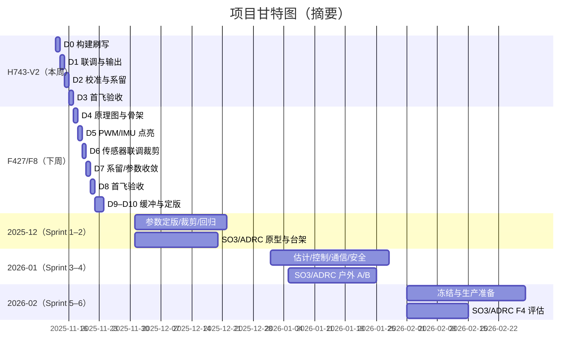

## Kite（鸢）飞控项目里程碑

参考对标：华科尔 F8 飞控系统（Walkera）[F8飞控系统](https://www.walkera.com/index.php?id=1894)

---

## 一、总目标与范围
- 本周（D0~D3）：完成 `boards/kite/h743-v2` 板的联调与首飞验收。
- 下周（D4~D10）：完成 F8 使用的 STM32F427 板级最小系统 bring-up、联调与首飞验收。
- 地面站：QGroundControl；飞控：PX4 Autopilot；分布式设备：可选 Cyphal(UAVCAN v1)。
- 说明：kite是本项目飞控代号

---

## 二、本周计划（H743‑V2 首飞）
时间窗口：从今天起至本周末（D0~D3）

### D0（今天）
- 确认工具链与构建：`kite_h743-v2_default` 成功编译与固件产出。
- Bootloader 与 Firmware 刷写；串口日志（调试 UART）正常输出 PX4 banner。
- SD 卡挂载、日志初始化；板上电压/电流 ADC 通道初检。
- 核对 `default.px4board` 与原理图的总线/引脚分配（SPI/I2C/UART、PWM/定时器/DMA、DRDY 中断）。

### D1（明天）
- 传感器联调：IMU（SPI+DMA+DRDY）、Baro、Mag；方向/旋转矩阵与频段/滤波参数初设。
- 定位与通信：GPS/RTK（u-blox 建链、波特率与GNSS模式）、RC（SBUS/CRSF）、数传（MAVLink2）。
- 动力输出：PWM/DSHOT 输出波形校验；电机转向与紧急停机测试。
- 日志配置：设定基础 topics 与日志率，验证回放。

### D2（后天）
- QGC 校准：陀螺仪/加速度计/磁力计/水平、指南针偏差；电池参数（电压/电流刻度）。
- 系留/低推力地面测试：姿态模式 -> 高度模式 -> 位置保持的小步进演练。
- 风险点清单快速排障：IMU 噪声/饱和、磁干扰、GPS 跳变、CPU 占用、SD I/O 抖动。

### D3（本周末）
- 户外首飞：姿态/高度/位置保持/基本航点。
- 复核日志指标，完成验收（见“验收标准”）。
- 产出交付物：参数预设文件（H7 版）、首飞日志、问题与调参记录。

---

## 三、下周计划（F427/F8 首飞）
时间窗口：下周（D4~D10）

### D4（周一）
- 原理图评审与资源映射：定时器/PWM 数量与频率、SPI/I2C/UART 分配、DMA/中断优先级、SD/存储。
- 新建板级骨架：`boards/<vendor>/<f427-board>/` 的 `default.px4board`、`bootloader.px4board`、`nuttx-config/`、`src/`。
- 最小化构建：上电串口 banner 输出、LED/蜂鸣器工作、基本 GPIO 校验。

### D5（周二）
- PWM 输出点亮与频率/占空比线性度验证；电调握手。
- IMU 首选用 SPI + DMA（若硬件允许），带 DRDY 中断。驱动自检与数据连续性验证。

### D6（周三）
- 传感器完善：Baro、Mag、GPS/RTK、RC/数传。
- QGC 全校准走通；F4 资源裁剪：关闭 EKF3/RTPS/重型任务，降低日志率与 topics。

### D7（周四）
- 室内系留/低推力演练；参数预设（F4 低算力友好）收敛。
- Cyphal（如使用）：节点发现、Param 同步、心跳/健康状态。

### D8（周五）
- 户外首飞：姿态/高度/位置保持/航点。
- 验收与日志复盘，出具问题单与修复计划。

### D9–D10（周末缓冲）
- 缺陷修复、复测与签收；文档与参数预设定版。

---

## 四、验收标准
### H743‑V2（本周）
- 启动稳定：串口日志正常、所有主要外设 ONLINE、SD 日志完好。
- 悬停 ≥ 3 分钟无 EKF reset；位置保持半径 ≤ 0.8 m（GNSS 良好条件）。
- CPU 使用率 < 60%，IMU 振动指标在 PX4 推荐范围；Failsafe/解锁流程正确。

### F427/F8（下周）
- 上电与最小系统稳定：串口/LED/蜂鸣器 OK，主要外设驱动 ONLINE。
- 悬停 ≥ 3 分钟；位置保持半径 ≤ 1.2 m；失联返航与低电动作正确。
- 资源约束达标：空闲 CPU ≥ 40%，内存不触及高水位；日志可回放。

---

## 五、关键交付物
- 固件包与构建产物（H743‑V2、F427/F8 各一份）
- 参数预设（H7 版、F4 版）
- 首飞/回归日志与解析报告（CPU/内存/IMU/VIBE/EKF 状态等）
- 问题清单与修复闭环记录

---

## 六、执行要点与命令参考
- H743‑V2 构建/刷写目标（示例）：
  - 构建：`make kite_h743-v2_default`
  - 刷写：`make kite_h743-v2_default upload`
- 目录与配置关注：
  - `boards/kite/h743-v2/default.px4board`（总线与外设映射、DMA/中断优先级）
  - `boards/kite/h743-v2/nuttx-config/`（RTOS 与外设驱动配置）
  - `src/drivers/*`（IMU/Baro/Mag/GPS/RC/输出等）
- 调参与校准：优先完成 QGC 全流程校准，再进行姿态/位置控制增益微调。

---

## 七、风险与缓解
- F4 资源瓶颈：裁剪模块、降低日志率、限制融合源；任务堆栈与周期重设。
- 振动/磁干扰：机械减振、走线与屏蔽；低通/Notch 设置与 IMU DRDY 中断。
- 供电异常：PMU 校准、欠压阈值；日志掉电保护。
- 总线负载：MAVLink 与 Cyphal 带宽与优先级规划，必要时分频/限速。

---

## 八、对标与扩展
- 对标能力参考：行业/教培/自动机场等应用场景与可靠性要求，见 Walkera F8 飞控系统介绍。
- 链接： [F8飞控系统（Walkera）](https://www.walkera.com/index.php?id=1894)

---

## 九、PX4 改善目标与算法目标（未来 3 个月）

### 9.1 总体KPI（H7 与 F4 分层）
- 可靠性：EKF reset ≤ 1 次/飞行小时；Failsafe 触发路径 100% 正确；解锁前健康检查全覆盖。
- 控制性能：
  - H7（H743‑V2）：姿态阶跃超调 ≤ 10%，位置保持 RMS ≤ 0.4 m（风速 5–7 m/s）。
  - F4（F427/F8）：姿态阶跃超调 ≤ 12%，位置保持 RMS ≤ 0.7 m（风速 5–7 m/s）。
- 资源与日志：H7 CPU < 60%，F4 空闲 CPU ≥ 40%；日志掉帧率 < 1%，关键话题可回放。
- 通信：MAVLink 链路利用率 < 60%；Cyphal 总线利用率 < 50%，节点掉线自动恢复。

### 9.2 传感器与状态估计（EKF2 为主）
- 采样/滤波：
  - H7：IMU 1–2 kHz、Rate 1–2 kHz；双 Notch（结构频/电机谐波）+ 动态低通（按电机转速）。
  - F4：IMU 1 kHz（必要时 500 Hz）、Rate 1 kHz；单 Notch + 低通，优先保证 CPU 余量。
- EKF2 配置与鲁棒性：
  - 磁融合门控与降级：磁创新超阈时减弱偏航观测权重；必要时退化为陀螺偏置慢收敛。
  - GPS/RTK：Fix/Float 状态门控、最小速度门限；RTK→GPS→定点保姿平滑降级。
  - 高度源：Baro 主、GPS 辅；对气压突变采用爬升/下降速率限幅与短期增益下调。
  - 地形估计：H7 可选开启，F4 默认关闭。
- 温补与校准：
  - H7：启用温补库与热箱建模；上线温漂曲线参数。
  - F4：维持静态校准与线性参数补偿。

### 9.3 控制器（多旋翼 MC）
- Rate 层：积分抗饱和、输出限幅保护；导数前馈限幅与微分噪声抑制；（H7 可选）Tracking Differentiator。
- Att/Vel 层：前馈与 jerk 限制；地效补偿；重力投影修正；强风航向耦合减弱。
- 混控与推力模型：饱和优先级（总推力/滚俯优先、偏航次之）；推力曲线标定与非线性补偿。
- 输出：H7 支持 DShot/反推/刹车；F4 以 PWM 为主，DShot 视定时器/DMA 可用性选择性开放。

### 9.4 轨迹与导航
- 轨迹生成：jerk 限制与拐角圆弧化，降低急停急转；速度/加速度平滑过渡。
- 航点/任务：入口条件门控（半径/速度/高度）；RTH 策略（爬升高度、返航点、下降速率）参数化与回放验证。

### 9.5 通信与分布式设备
- MAVLink：消息分级与带宽整形，防止与日志并发拥塞；关键 telemetry 优先级固定。
- Cyphal（UAVCAN v1）：节点发现、心跳/健康；参数同步映射（对接 `src/drivers/cyphal/ParamManager.cpp`）；双 PMU/双 GPS 失效切换测试。
- RTK/差分：RTCM 通路与缓冲、Fix/Float 状态门控飞行模式。

### 9.6 可靠性与安全
- 预臂检查强化：传感器健康/姿态/磁状态/GPS/电量/日志可用性。
- 看门狗与欠压：掉电保护、FATFS 刷新确保日志完整；Failsafe（失联/低电/姿态异常）一致化。
- 地理围栏：多边形/圆形；任务上传校验与回滚。

### 9.7 资源与性能目标
- H7（H743‑V2）：Rate 1–2 kHz、Att/Pos 250–500 Hz；CPU < 60%；日志率中高；可启用风估计/温补/双 Notch。
- F4（F427/F8）：Rate 1 kHz、Att/Pos 200–250 Hz；空闲 CPU ≥ 40%；关闭 EKF3/RTPS 等重模块；日志率下调并启用 topics 白名单。

### 9.8 工具链与测试
- SITL/HIL 回归集合：起降、悬停、风扰、失联、低电、RTK 切换；每日构建与周度稳定版。
- 硬件回归：上电/解锁/故障注入脚本化；自动解析 CPU/内存/IMU/VIBE/EKF 指标。
- 交付物：H7/F4 参数预设、测试报告、回放脚本与一键校准工具。

### 9.9 可选控制器：SO(3) 与 ADRC（评估与试点）
- 目标（3 个月内）：
  - H7（H743‑V2）完成 SO(3) 姿态控制器与 ADRC（Rate 层二阶 ESO）实现、SITL/HIL、台架与户外 A/B 对比，形成是否纳入候选基线的结论与参数集。
  - F4（F427/F8）仅进行可行性与开销评估，必要时提供轻量实现预研，不纳入量产基线。
- 技术路径：
  - SO(3) 姿态控制：在旋转群上直接构造姿态误差（误差四元数/旋量或 R_err），输出期望角速度/力矩；配合混控饱和优先级（总推力/滚俯优先、偏航次之）与积分抗饱和。关键增益：kR、kΩ。
  - ADRC（Active Disturbance Rejection Control）：Rate 层二阶扩张状态观测器（ESO）估计总扰动并补偿；引入导数前馈限幅、输入限幅与降噪滤波，观测器带宽 β1/β2/β3 调参。
  - PX4 集成方式：以参数门控新增 `mc_att_control_so3`、`mc_rate_control_adrc` 模块；保持 uORB 接口一致；日志增加观测器状态与误差项。
- 资源与周期：
  - H7：SO(3) 每循环 < 20 µs，ADRC ESO < 30 µs（1–2 kHz）。
  - F4：Rate 1 kHz 下总开销建议 < 40 µs，如超限则仅限实验分支与 SITL/HIL。
- 风险与缓解：调参敏感与噪声放大风险；采用限幅、低通/Notch、系留与小推力逐级放飞；失败快速回退到 PID。
- 时间表（对应第十章）：
  - 12 月：SITL/HIL 原型完成、台架闭环（H7），参数初值库。
  - 1 月：H7 户外风扰/负载 A/B 对比，出评估报告与候选参数。
  - 2 月：F4 轻量实现可行性评估；量产基线仍为 PID，SO(3)/ADRC 以“实验功能”形态保留（默认关闭）。
- KPI（H7 目标）：
  - SO(3)：大角度扰动恢复时间相对 PID 下降 ≥ 15%，姿态阶跃超调 ≤ 10%。
  - ADRC：阵风 5–8 m/s 条件下角速度 RMS 下降 ≥ 10%，平均功耗不升高 > 3%。

---

## 十、3 个月时间表与交付（至 2026‑02），量产准备（2026‑03 启动）

### 10.1 2025‑12（Sprint 1–2）
- H7：首飞后参数定版 V1；双 Notch 与 Rate/Att 收敛；RTH/低电路径验证。
- F4：板级裁剪方案确定；IMU/Baro/Mag/GPS/RC/电机输出稳定；日志策略与话题白名单落地。
- 测试：SITL 场景集 V1；硬件回归脚本化（基本科目）；故障注入初版。
- 交付：H7/F4 参数预设 V1、回归日志与报告。
- SO(3)/ADRC：SITL/HIL 原型实现完成，H7 台架闭环与初步调参。

### 10.2 2026‑01（Sprint 3–4）
- 估计与控制：磁融合鲁棒/RTK 降级策略定版；地效补偿与 jerk 限制上线。
- 通信与分布式：Cyphal 参数同步验证、PMU 冗余切换；MAVLink 带宽整形。
- 可靠性：预臂检查覆盖率提升；看门狗/欠压/地理围栏全链路演练。
- 交付：稳定版固件 R1；工装校准流程（Bench SOP）V1；回放与指标自动化报告。
- SO(3)/ADRC：H7 户外 A/B 对比（风扰、负载变化），形成是否纳入候选基线的结论与参数集。

### 10.3 2026‑02（Sprint 5–6）
- 性能固化：控制/估计参数冻结候选；HAL/驱动变更冻结；缺陷收敛与回归通过。
- 生产准备：产线烧录/校准工装、SN/追溯系统、参数写入与验收脚本；出厂自检清单。
- 交付：量产候选固件 RC、参数预设 RC、生产文档（SOP/维修手册/放行标准）V1。
- SO(3)/ADRC：F4 轻量实现可行性评估；量产基线仍采用 PID，SO(3)/ADRC 以实验功能保留（默认关闭，参数门控）。

---

## 十一、量产准备清单（2026‑03 启动）
- 冻结点：2026‑02‑15 固件/参数/硬件 BOM 冻结；2026‑02‑28 回归通过并签发 RC→Release。
- 生产与品质：
  - 工装：烧录/校准/自检一体工装；治具接口与安全联锁。
  - 标定：IMU/磁/电源校准自动化；写入序列号与追溯信息。
  - 放行：出厂自检脚本 100% 通过；关键日志留档；SPC 监控（良率/返修率）。
- 文档与支持：维修手册、服务政策、版本变更记录、QGC 指南、远程升级策略。
- 远程运维：参数/固件 OTA 流程、回滚保护、远程日志采集。
- 实验功能策略：SO(3)/ADRC 作为实验功能默认关闭，参数门控与快速回滚说明。

---

---

## 十二、量产阶段风险与对策
- 供应链：关键传感器/电源芯片供给与替代料清单；EOL 监控与双供。
- EMC/电磁干扰：布线/屏蔽/接地；电机与电源纹波抑制；实验室预一致性测试。
- 机械与振动：减振结构与安装规范；振动频谱测试纳入出厂抽检。
- 环境与可靠性：高低温/湿热/盐雾抽测；防护等级与密封；防水冲击测试（如需）。
- 软件稳定性：回归覆盖率指标与故障注入；紧急修复与回滚流程演练。

## 十三、时间甘特图（Markdown 摘要）

提示：本节为快速预览。可在本目录打开 `milestone_gantt.xlsx` 获取可交互图表。

### 13.1 近两周关键节点（D0–D10）

| ID | 任务 | 起 | 止 | 天数 |
|---|---|---|---|---|
| H743-D0 | H743 构建与刷写、串口与SD初始化 | 2025-11-13 | 2025-11-13 | 1 |
| H743-D1 | 传感器/GPS/RC/数传联调、电机输出与日志配置 | 2025-11-14 | 2025-11-14 | 1 |
| H743-D2 | QGC校准 + 系留/低推力演练 + 风险排障 | 2025-11-15 | 2025-11-15 | 1 |
| H743-D3 | 户外首飞与验收、参数预设与日志交付 | 2025-11-16 | 2025-11-16 | 1 |
| F427-D4 | F427 原理图/资源映射、板级骨架与最小化启动 | 2025-11-17 | 2025-11-17 | 1 |
| F427-D5 | PWM/ESC、IMU SPI+DMA+DRDY 点亮 | 2025-11-18 | 2025-11-18 | 1 |
| F427-D6 | Baro/Mag/GPS/RC/数传联调、QGC校准与功能裁剪 | 2025-11-19 | 2025-11-19 | 1 |
| F427-D7 | 室内系留与参数收敛、Cyphal 节点与 Param 同步 | 2025-11-20 | 2025-11-20 | 1 |
| F427-D8 | 户外首飞、验收与日志复盘 | 2025-11-21 | 2025-11-21 | 1 |
| F427-D9 | 缺陷修复、复测与签收（缓冲） | 2025-11-22 | 2025-11-22 | 1 |
| F427-D10 | 文档与参数预设定版（缓冲） | 2025-11-23 | 2025-11-23 | 1 |

### 13.2 三个月计划甘特（摘要）

